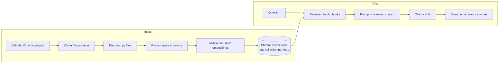

# rag-copilot

Chat with any Python codebase, fully local. Point it at a GitHub repo (or a
local folder), it clones/embeds/indexes the code on your machine, and you ask
questions against it through a Streamlit chat UI — answered by a local
[Ollama](https://ollama.com) model, with the source files it used shown
alongside every answer. No API keys, nothing leaves your machine.

<!-- TODO: drop a screenshot or short GIF of the chat UI here once it's running -->

## Architecture



Tech stack: LangChain · Chroma · sentence-transformers · Ollama · Streamlit · uv.

## Quickstart

**1. Install Ollama and pull a model**

```bash
brew install ollama        # or see https://ollama.com/download
ollama serve
ollama pull qwen2.5-coder:1.5b
```

**2. Install project dependencies** ([uv](https://docs.astral.sh/uv/) required)

```bash
git clone <this-repo-url>
cd rag-copilot-app
uv sync
```

**3. Run the app**

```bash
uv run streamlit run app/streamlit_app.py
```

**4. Index a repo and chat**

In the sidebar, paste a GitHub URL (e.g. `https://github.com/pallets/flask`)
or a local path, click **Ingest**, then ask questions in the chat panel.
Every answer includes a **Sources** expander listing the exact files that
were retrieved for it. Previously-ingested repos stay available in the
sidebar dropdown so you can switch between them without re-indexing.

## CLI

The same ingestion and chat logic is also available without the UI:

```bash
uv run python app/cli.py ingest https://github.com/pallets/flask
uv run python app/cli.py list
uv run python app/cli.py chat flask
```

There's also an installed `rag-copilot` command (`uv run rag-copilot ...`)
pointing at the same code, but it depends on the project's editable install
correctly putting `src/` on `sys.path`, which isn't reliable on every
machine/Python build. `app/cli.py` bootstraps that path itself before
importing anything, the same way `app/streamlit_app.py` does — use it if
`rag-copilot` raises `ModuleNotFoundError: No module named 'rag_copilot_app'`.

## Configuration

Copy `.env.example` to `.env` to override any default — Ollama model,
embedding model, chunk size/overlap, retriever `k`, or where cloned repos /
the vector store / the cached embedding model live.

## Project layout

```
src/rag_copilot_app/
    config.py          # env-driven settings
    loaders.py          # repo resolution (clone/local) + file discovery
    splitter.py          # Python-aware chunking
    ingest.py          # ingest_repo(): the indexing pipeline
    rag_chain.py          # RagSession: retriever + local LLM, streaming
    ollama_utils.py          # Ollama health checks
    cli.py          # `rag-copilot` command
app/streamlit_app.py          # the chat UI
tests/          # loaders/splitter/chain-wiring tests (no model or network calls)
```

## Tests

```bash
uv run pytest
uv run ruff check .
```

These cover file discovery, chunking, and chain wiring (using LangChain's
built-in fake chat model) — nothing that needs a running Ollama daemon or a
downloaded embedding model, so they run in CI on every push. End-to-end
behavior (real embeddings, real Ollama inference) is verified manually.

## Limitations / roadmap

- Python-only ingestion for now; multi-language chunking (JS/TS/Go/etc.) is a
  natural next step.
- No Docker packaging — Ollama and the app both run directly on the host.
- Local-only by design: this is a personal tool, not a hosted service.

## License

MIT — see [LICENSE](LICENSE).
